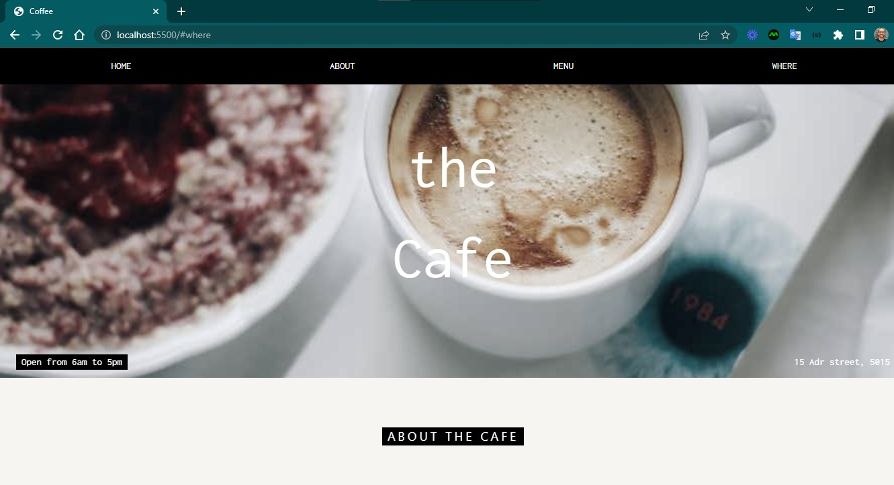
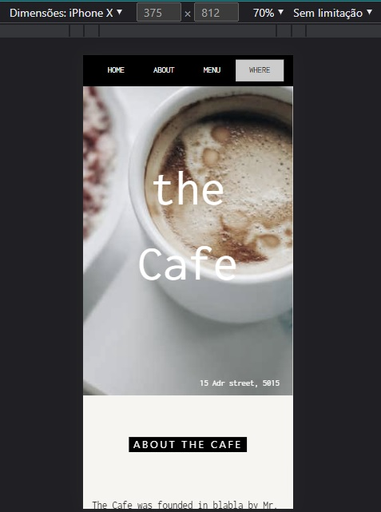

<h4 align="center"> 
	🚧 Coffee 🚀
</h4>

<h1 align="center">
    
</h1>

- Projeto de um site institucional de um café.

#### Requisitos

- [x] design personalizado
- [ ] responsividade
- [ ] favicon

#### Telas

- Desktop

    

- Mobile

    

